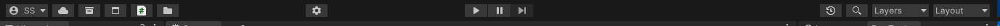
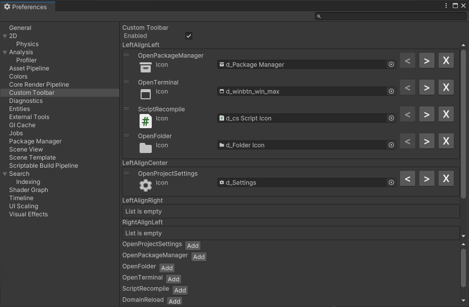

# Custom toolbar
[](https://openupm.com/packages/com.redwyre.custom-toolbar/)

- Configuration per user in user preferences
- Easy to extend by writing functions with an attribute
- Fully customisable, you can add and remove buttons, and move them to different areas of the toolbar, and change the images of the buttons
- All UI Toolkit based

Toolbar


Preferences


# Installing

## From GitHub

From the package manager window, click the + and select the option to use a git url, and paste in https://github.com/redwyre/com.redwyre.custom-toolbar.git

## From OpenUPM

If you are already using OpenUPM you can merge this snippet with your project manifest:
```
{
    "scopedRegistries": [
        {
            "name": "package.openupm.com",
            "url": "https://package.openupm.com",
            "scopes": [
                "com.redwyre.custom-toolbar"
            ]
        }
    ],
    "dependencies": {
        "com.redwyre.custom-toolbar": "0.1.0"
    }
}
```

For more ways to install with OpenUPM see https://openupm.com/packages/com.redwyre.custom-toolbar/

# Adding your own

## Adding a button

To add a button to the toolbar, create a new static function in a class, and add the `[ToolbarButton]` attribute to it. The function should take no parameters and return void.

```csharp
using Redwyre.CustomToolbar.Editor;

public static class BasicToolbarItems
{
    [ToolbarItem(Icon = "Settings", ToolTip = "Project Settings")]
    public static void OpenProjectSettings()
    {
        EditorApplication.ExecuteMenuItem("Edit/Project Settings...");
    }
}
```

## Adding a toggle strip

To add a toggle strip to the toolbar, create a new static function in a class, and add the `[ToolbarItem]` attribute to it with the same number of icons as options. The function should take an `int?` parameter and return an int. The function is passed null when the toolbar wants to get the current value without changing it.

```csharp
    [ToolbarItem(ToolTip = "Memory Leak Detection", Icons = new[] {"MemoryLeakDetection_0.png", "MemoryLeakDetection_1.png", "MemoryLeakDetection_2.png" })]
    public static int MemoryLeakDetection(int? newValue)
    {
        if (newValue.HasValue)
        {
            // Set the new value here     
        }

        // Get and return the current value here
    }
```

# Why

After having to manually force a domain reload multiple times I got the idea that it would be great to have a customisable toolbar that I could add it to while the rest of the team could have their own configurations that reflect their workflows.

There are a few existing projects that I want to acknowledge, each has some good ideas but individually didn't do what I wanted:

https://github.com/marijnz/unity-toolbar-extender
The OG toolbar library, but using IMGUI, not configurable.

https://github.com/smkplus/CustomToolbar
Configured in the project instead of user preference, outdated styles, can't add new functions.

https://github.com/BennyKok/unity-toolbar-buttons
Good ideas with simple functions, but no customisability


Uses tertle's EditorToolbar.cs as a starting point
https://gitlab.com/tertle/com.bovinelabs.core


So with a 4 day weekend I decided to have a go at working on it myself, and here we are.
